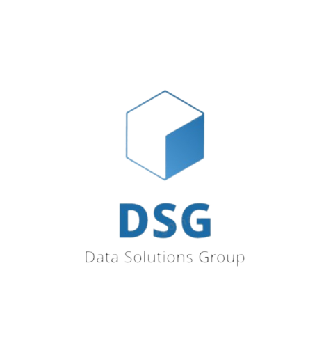
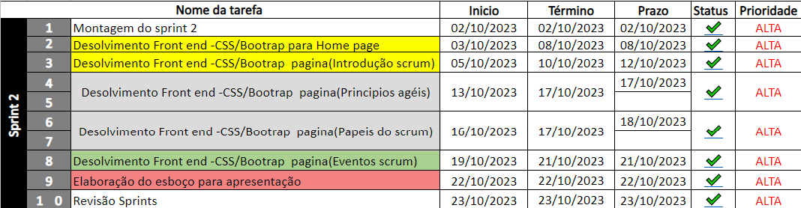
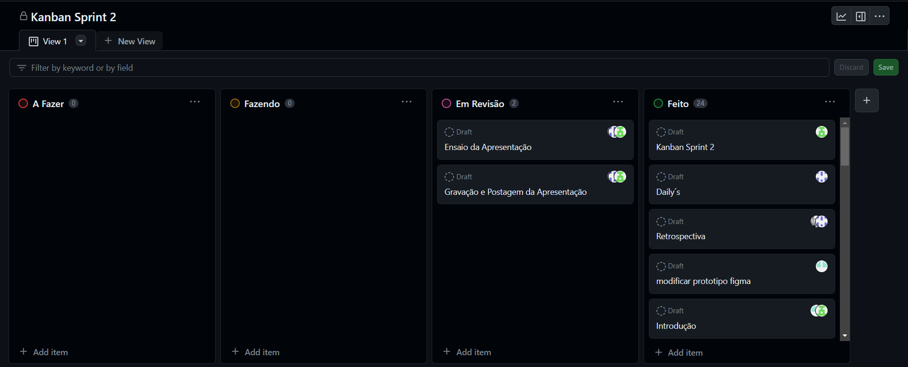
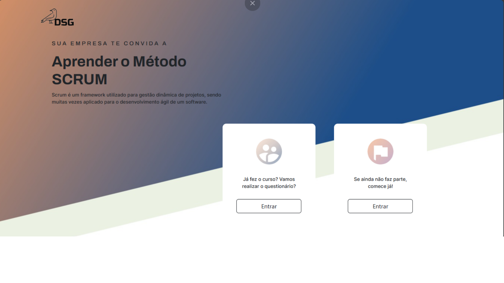
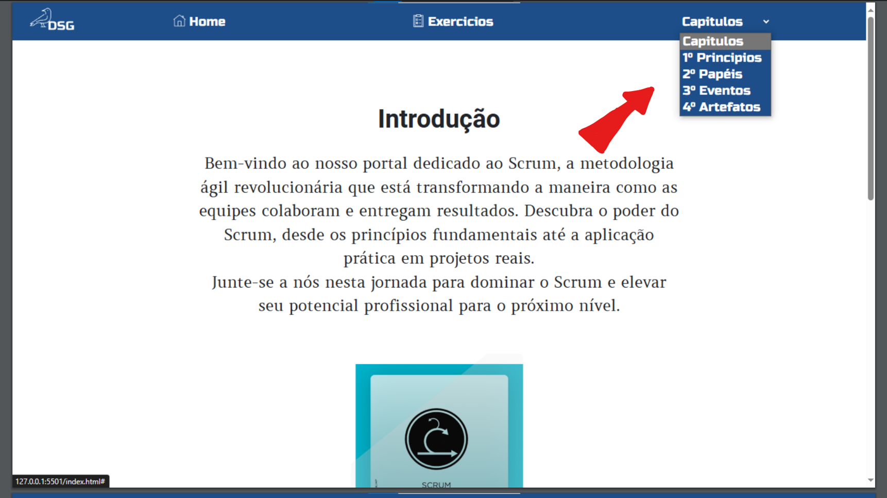
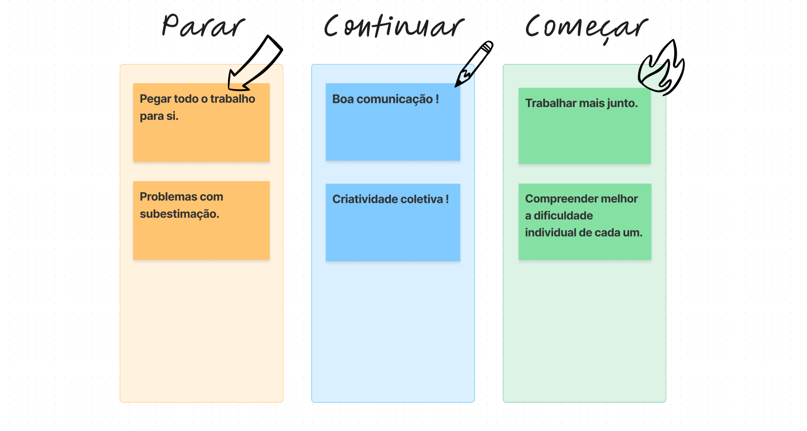

  

<h1>DSG - DATA SOLUTIONS GROUP</h1>

 > Status: Developing ⚠️

<h1 align="center">Sprint 2: 02/10/2023 a 27/10/2023 </h1>

  <a href="#backlog">Backlog</a> |
  <a href="">Burndow</a> |
  <a href="">Product Backlog</a> |
  <a href="">Equipe</a> 

<h2>💡Sobre o Projeto:</h2>

Este projeto tem como principal objetivo a padronização das práticas do Scrum, com foco na sua aplicação prática em um ambiente empresarial. Ele foi desenvolvido para atender às exigências do cliente e visa proporcionar uma abordagem consistente e eficiente para gerenciamento de projetos.

 
<h1>⚙️Backlog</h1>

## 📝Requisitos Funcionais
* Apresentação via GitHub;
* O sistema web deverá ser intuitivo e não ter poluições de informações, isso deverá ser uma preocupação constante dos desenvolvedores, sugestões de controles serão bem-vindas e bem avaliadas;
* Criar um sistema de avaliação (Processo, Produto e Conhecimento em disciplina, SM., PO., TD);
* Processo Scrum;
* Burndown;
* Product e Sprint Backlog;
* Sprint;
* Sprint Planning;
* Sprint Backlog;
* Dailys;
* Retrospective;
* DOR – Definition of Ready;
* DOD – Definition of Done;
* Planning Poker;
* Kanban;
* Artefatos do Scrum;
* MVP.

  ## 📚Requisitos Não Funcionais
* Documentação no GitHub;
* Linguagem de programação JavaScript;
* Linguagem de marcação HTML e estilos CSS;
* Uso do framework Bootstrap;
* JavaScript;
* HTML;
* CSS;
* SK;
* Bootstrap;
* Figma.

<h2>Product Backlog</h2>

Nessa Sprint definimos alguns dos requisitos funcionais que teriam em nosso site, na sprint em questão implementamos 5 páginas do mesmo utilizado majoritariamente HTML, CSS e BOOTSTRAP.

## 📈 Burndown

Podemos ver que a pricípio tudo ocorreu como planejado até que perto da data de entrega nós infelizmente perdemos um pouco de desempenho com relação a entrega de trabalho mas logo conseguimos recobrar esse atraso e entregamos dentro do prazo.

<h2>Daily-S2</h2>

  Aqui está todas as reuniões feitas nessa sprint junto com a palavra de cada um dos integrantes do que foi feito e o que iriam fazer para que se pudesse controlar de melhor forma o desempenho e acompanhar o progresso do projeto.

## 📋Kanban da Sprint

  Nessa sprint também utilizamos uma ferramenta de kanban proporcionado pelo próprio github para que pudessemos dividir as tarefas maiores em "tasks" menores e facilitarmos a compreensão e a visão da equipe com relação ao trabalho a ser entregue. 

   

<h2>
  Observações do Projeto 🤓.
</h2>

  Aqui temos algumas modificações feitas da sprint passada até essa sprint no projeto, podemos observar que a tela Home continua muito parecida com a versão anterior mas se compararmos a página de introdução já conseguimos perceber as mudanças para uma cor mais solida de azul ao invés daquela coloria e a barra de navegação que antes se encontrava no lado esquerdo da página decidimos mudar ela para o topo pois, chegamos na conclusão que estava ocupando muito espaço de tela e seria ruim ao usuário em questão de design e usabilidade além de diminuir a quantidade de topicos agrupando eles em um unico tópico chamado "capitulos" onde seria um botão que quando clicado aparece todos os tópicos do curso em ordem cronológica.

  

    
  

  

    
  

## 🤔Retrospectiva

   Aqui está a retrospectiva da sprint com tudo que acreditamos que deveria continuar, mudar e começar para melhorar a nossa comunicação e compreensão da equipe de modo geral.

    

## 🚀Ferramentas Utilizadas

## 👩‍💻Equipe

| Função         | Integrantes           |
| ---------------|-----------------------|
| Product Owner  | Isaac Souza Santos  |
| Scrum Master    | Fillipe Pereira Bueno de Almeida  |
| Dev Team | Tiago Santini Da Silva  |
| Dev Team | Renan Ming Han  |
| Dev Team | Evellin Amorim da Silva  |
| Dev Team | Marcio Roberto Bueno Júnior  |
| Dev Team | Jorge Antônio Signorini Júnior  |Sprint 2/README.md
